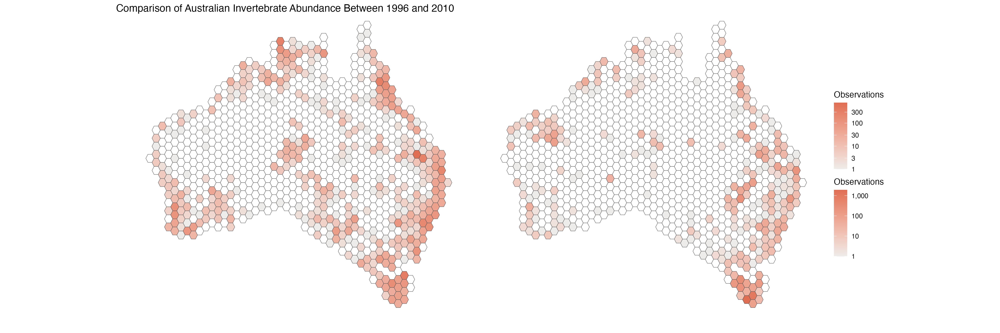

---
#### title: "Creation of a new tutorial"
output: html_document
css: Misc/style.css
---

<div class="banner">
  <h1>DATA VISUALISATION:</h1>
  <h2>CONCAVE HULLS AND HEXAGONAL GRID MAPS</h2>
</div>

_Created by Amelia Young - November 2024_

--------

# Quantifying species' geographical range and visualising the impact of the Australian 'Black Summer' on invertebrates


### Tutorial aims & steps:

### <a href="#section1"> 1. Introduction</a>
#### <a href="#prerequisites"> - 1.1 Prerequisites</a>
#### <a href="#data"> - 1.2 Overview of the Data</a>
#### <a href="#importance"> - 1.3 The Importance of Analysing Trends in Ecology and Open Science</a>

### <a href="#section2"> 2. Preparing the Data</a>
#### <a href="#loading"> - 2.1 Loading the Data</a>
#### <a href="#filtering"> - 2.2 Cleaning and Filtering the Data</a>

### <a href="#section3"> 3. Exploratory Data Analysis and Concave Hull Maps</a>
#### <a href="#nesting"> - 3.1 Nesting Data</a>
#### <a href="#maps"> - 3.2 Retrieving Australia Polygon</a>
#### <a href="#ausmap"> - 3.3 Concave Hull Maps: Plotting Spatial Distributions</a>
#### <a href="#subsetmaps"> - 3.4 Concave Hull Maps: Subsetting Species</a>

### <a href="#section4"> 4. Hexagonal grid maps and Further Visualisation</a>
#### <a href="#furtherfiltering"> - 4.1 Further Data Filtering</a>
#### <a href="#tibbles"> - 4.2 Using Tibbles</a>
#### <a href="#plotting"> - 4.3 Plotting hexagonal grid maps</a>

### <a href="#section5"> 5. Conclusions and Summary

### <a href="#section6"> 6. Challenge Yourself!</a>

----

Following on from the <a href="https://ourcodingclub.github.io/tutorials/data-vis-2/" target="_blank">Data Visualisation: Part 2</a> tutorial, we will now be exploring alternative ways to visualise data through _concave hull maps_, and _hexagonal grid maps._
The possibilities for data visualisation are limitless, and this tutorial aims to equip you with two more powerful techniques for your toolkit!

<a name="section1"></a>

### 1. Introduction
The 2019–2020 Australian wildfires, known as the "Black Summer" fires, inflicted widespread devastation on natural habitats and native biodiversity. This tutorial will use a dataset from [CSIRO, Data Access Portal](https://data.csiro.au/collection/csiro:56679), to visualise Invertebrates' spatial distribution (concave hull maps), and geographical spread (hexagonal grid maps), before and after the Black Summer fires. The impact on invertebrates, (insects, molluscs, spiders), is often overlooked after natural disasters. Which makes open access diversity data even more essential in understanding potential trends, so scientists and conservationists can identify which species or regions face the most significant threats, helping to prioritise population growth. 

_Concave Hull Maps are minimum bounding polygons that tightly enclose points. We aim to create compact polygons around species' occurrence points, revealing insights into their spatial distribution across the landscape_


<a name="prerequisites"></a>

### 1.1 Prerequisites
Whilst this tutorial is of basic to intermediate difficulty, we recommend that learners go back and first complete the <a href="https://ourcodingclub.github.io/tutorials/datavis/" target="_blank">Data Visualisation: Part 1</a> tutorial and <a href="https://ourcodingclub.github.io/tutorials/data-vis-2/" target="_blank">Data Visualisation: Part 2</a> tutorial.

To get the most out of this tutorial, you should have a basic understanding of the following:


- **Data manipulation with `dplyr`:** Transforming, cleaning, and filtering data.  

- **Data visualisation with `ggplot2`:** Creating plots to explore and communicate data patterns.  

_For more on ```ggplot2```, read the official <a href="https://www.rstudio.com/wp-content/uploads/2015/03/ggplot2-cheatsheet.pdf" target="_blank">ggplot2 cheatsheet</a>._

 

<a name="data"></a>

### 1.2 Overview of the Data
The dataset is based on studies that investigated the impact of the Black Summer bushfires and is designed to support future modelling and impact assessments. The dataset also has a 'sister' dataset of plant observations for the same purpose.

The data consists of individual observations, recorded from 1634 onwards. Each row of the dataset represents a single sighting, recorded at a location, and includes information such as the invertebrates' scientific name, class, family, and year of sighting. There are 340,059 observations. The data can be summarised as follows: 

|                   | Scientific Name  | Class   | Family   | Observations |
|-------------------|------------------|---------|----------|--------------|
| __Invertebrates__ | 50821            | 50      | 2171     | 340059       |


<a name="importance"></a>

### 1.3 The Importance of Analysing Trends in Ecology and Open Science
Analysing trends in ecology through open science is essential for effective conservation, ecosystem management, and education. It enables scientists to monitor biodiversity, assess ecosystem health, and respond to environmental challenges, such as natural disasters. Open access to ecological data promotes global transparency, allowing researchers worldwide to build on each other’s work while also supporting student science and public engagement. The <a href="https://ourcodingclub.github.io/tutorials.html" target="_blank">coding club tutorials</a> are an excellent example of harnessing the power of data and sustainable learning!


---

<a name="section2"></a>

### 2. Preparing the Data


You can find all the data for this tutorial on [this repository](https://github.com/EdDataScienceEES/tutorial-AmeliaYoung/tree/master). Clone and download the repo as a zip file, then unzip and set the folder as your working directory by running the code below (replacing with your actual folder path), or clicking `Session/ Set Working Directory/ Choose Directory` from the RStudio menu.

Alternatively, you can fork [the repository](https://github.com/EdDataScienceEES/tutorial-AmeliaYoung/tree/master) to your own GitHub account and then add it as a new RStudio project by copying the HTTPS/SSH link. For more details on how to register GitHub, download Git, sync RStudio and Github and use version control, please check out this [Git tutorial.](https://ourcodingclub.github.io/tutorials/git/index.html)

Make a new script file through clicking `File/ New File/ R Script`, give it a title and some information, and we are all good to go!


<a name="loading"></a>

### 2.1 Loading The Data

Start by copying the following code into your script to load the data.

```r 
## Data Visualisation: Concave Hulls and hexagonal grid maps
#  Quantifying species range and visualising the impact of the Australian 'Black Summer'
#  YOUR NAME
#  DATE

setwd("PATH_TO_YOUR_FOLDER") # Set working directory to the folder where you saved the data

# Read in data ----
invertebrates <- read.csv("Data/invertebrate.data.03.2023.csv")

# Load libraries ----
library(tidyverse) # # contains dplyr (data manipulation), ggplot2 (data visualisation) and other useful packages
library(cowplot)  # making effective plot grids
library(sf) # for working with spatial data (simple features)
library(concaveman) # for creating concave hulls
library(ozmaps) # for polygon maps
library(patchwork) # for arranging plots

```

<a name="filtering"></a>

### 2.2 Cleaning and Filtering the data

For the purpose of this exercise, we’re going to filter out observations not on mainland Australia or Tasmania, as well as any species with fewer than 4 observations. 

```r
# Filtering Data ----

# Identify species that have more than 4 observations 
more_than_4_obs <- invertebrates %>%
  group_by(scientific_name) %>%
  summarise(n_obs = n()) %>% 
  filter(n_obs > 4) %>% 
  pull(scientific_name)

# Subset species with more than 4 observations and appear on mainland Australia & Tasmania
inverts_subset <- invertebrates %>%
  filter(scientific_name %in% more_than_4_obs)

subset_mainland <- inverts_subset %>% 
  filter(latitude < -10, latitude >= -45, longitude >= 113, longitude <= 155) %>% 
  select(scientific_name:family, longitude, latitude)

```


<a name="section3"></a>

### 3. Exploratory Data Analysis and Concave Hull Maps

Great! Now for the fun part! We are ready to show the geographic range of these data. However, having almost 51,000 species makes it challenging to visualise all data points and concave hulls at once. Instead we will be randomly selecting one invertebrate species from each __class,__ and using ```set.seed``` to make sure we all get the same results. Enter ```?set.seed``` into your terminal for more information on random number generation. 


<a name="nesting"></a>

### 3.1 Nesting data


The first step is to group our ```longitude``` and ```latitude``` columns into a single column named ```coords```, we do this using the [```nest```](https://tidyr.tidyverse.org/articles/nest.html) function:

```r
# Nest occurrence data ----
inverts_nest <- subset_mainland %>% 
  nest(coords = c(longitude, latitude))

inverts_nest %>%
  print(n = 6)

inverts_nest %>% 
  pluck("coords", 1) %>%  # 1 refers to the first element of the list column
  print(n = 6)
```

The code above also prints the first 6 rows of ```inverts_nest``` to show how the ```coords``` column contains [nested tibbles](https://tidyr.tidyverse.org/articles/nest.html). 

We also access the first of these tibbles using ```pluck```. -Try exploring this further by changing ```'1'``` to ```'2'```, ```'3'``` or ```'4'```!

Now we will set our random seed and subset a random species from each ```class``` as mentioned above: 

```r
# Subset a random species from each class 
set.seed(123)  # Set seed so we all get the same results
subset <- inverts_nest %>% 
  group_by(class) %>% 
  slice_sample(n = 1)
```

Great! Now for a couple of tricky steps... We need to convert our coordinates into ```sf``` objects, compute the concave hulls, and then unnest the concave hull column.

_An ```sf``` (simple feature) object is a specialised data structure used in R for working with spatial data, provided by the ```sf``` package. It represents spatial features, such as points, lines, or polygons, in combination with their associated attribute data (similar to rows in a data frame)._

```r
# Convert coordinates into sf object and compute concave hulls as list columns.
subset_concave <- subset %>%
  mutate(points_sf = map(.x = coords,
                         ~ st_as_sf(.x, coords = c("longitude", "latitude"),
                                    crs = 4326)), 
         concave_sf = map(points_sf,
                          ~ concaveman(.x)))
```

__Purpose:__ Converts our geographic coordinates into spatial objects for further manipulation, and we create the concave hulls


__Steps:__


- The ```map``` function iterates over the ```coords``` column, which we known contains tibbles of geographic coordinates.


- ```st_as_sf:``` Converts each tibble into an ```sf``` (simple feature) object. Uses the longitude and latitude columns for spatial geometry. Assigns the crs (coordinate reference system) to WGS84 (EPSG:4326), which is a global latitude/longitude system.

- ```concaveman```: Computes a concave polygon that encloses the points in the sf object. Resulting in each row in the ```concave_sf``` column containing a polygon geometry as an sf object.


```r
# Unnest the concave hull list column
subset_concave <- subset_concave %>% 
  select(scientific_name:family, concave_sf) %>% 
  unnest(cols = c(concave_sf)) %>% 
  ungroup() %>%
  st_sf(crs = 4326) 
```

__Purpose:__ Here we flatten and structure the data for easier visualisation.


__Steps:__


- ```select```: Retains only relevant columns:```(scientific_name:family)``` and the ```concave_sf``` column.


- ```unnest```: Expands the ```concave_sf``` list-column into rows. Each concave hull polygon becomes a separate object associated with its ```(scientific_name:family)```.


- ```ungroup```: Removes any grouping applied earlier.


- ```st_sf```: converts the resulting dataframe into an sf object with CRS 4326. The final result is a spatial dataframe with polygon objects.


For further reading on nesting and unnesting, check out [this article](https://bookdown.org/Maxine/r4ds/nesting.html). 

<a name="maps"></a>

### 3.2 Retrieving Australia Polygon


Finally! Helpfully, we can retrieve a polygon in the shape of Australia using the ```ozmap``` package, which provides geographic data for Australia. Australia is number 4326!

```r
# Retrieve Australia polygon ----
aus <- st_transform(ozmap_country, 4326)
```

Time to plot!!!

<a name="ausmap"></a>

### 3.3 Concave Hull Maps: Plotting Spatial Distributions


```r
# Plotting spatial distributions ----
(inverts_concave <- ggplot() + 
  geom_sf(data = aus, colour = "black", fill = NA) +
  geom_sf(data = subset_concave, fill = "#609966", alpha = 0.2, lwd = 0) +
  coord_sf(xlim = c(110, 155)) +
  ggtitle("Spatial Distributions of Invertebrates Across Australia") + 
  theme_void())

```

<center></center>

So cool! - remember surrounding your ```ggplot``` code with curly brackets means the plot will automatically show in the 'plots' panel, instead of having to call it manually.

<a name="subsetmaps"></a>

### 3.4 Concave Hull Maps: Subsetting Species

Now we've done all the hard work, it is also very easy to subset ```subset_concave``` for one ```family``` if you know the scientific name. Below we create concave hull maps for earthworms (_Megascolecidae_) and sea spiders (_Callipallenidae_)! If you want to investigate your own family, enter ```unique(subset_concave$family)``` into your console for a list of options.

```r
# Subsetting for just earthworms! ----

(worm_concave <- ggplot() + 
   geom_sf(data = aus, colour = "black", fill = NA) +
   geom_sf(data = subset_concave %>% filter(family == "Megascolecidae"), 
           fill = "#609966", alpha = 0.2, lwd = 0) +
   coord_sf(xlim = c(110, 155)) +
   ggtitle("Spatial Distributions of Earthworms Across Australia") + 
   theme_void())
```

<center></center>

```r
# Subsetting for just sea spiders! ----

(spider_concave <- ggplot() + 
   geom_sf(data = aus, colour = "black", fill = NA) +
   geom_sf(data = subset_concave %>% filter(family == "Callipallenidae"), 
           fill = "#609966", alpha = 0.2, lwd = 0) +
   coord_sf(xlim = c(110, 155)) +
   ggtitle("Spatial Distributions of Sea Spiders Across Australia") + 
   theme_void())
```

<center></center>


<a name="section4"></a>

### 4. Hexagonal grid maps and Further Visualisation

So far we've explored the geographical range of Australia's invertebrates and learnt how to represent these on concave hull maps. Next, we're going to investigate how invertebrate populations were affected by the 2019/2020 wildfires, through hexagonal grid maps. Hexagonal grid maps (commonly known as hex maps) are a method for visualising the distribution of a species and the relative frequency of its occurrence within specific areas. In the context of this tutorial, we expect to see a decrease in invertebrate populations between 2018 and 2020, due to the wildfires. 

<a name="furtherfiltering"></a>

### 4.1 Further Data Filtering

To make sure our hex map is accurate and informative, we will make it manually. We can do this by creating a grid of hexagons, filtering the grid to the outline of Australia; and adding our invertebrate data to adjust the fill colour of those hexagons.

```r
# FIRE INVESTIGATION: ----

grid_all <- st_make_grid(aus, 
                         cellsize = 1, 
                         what = "polygons", 
                         square = FALSE,
                         flat_topped = TRUE)

ggplot() +
  geom_sf(data = grid_all)

# extract rows that are within AUS land
keep_hexes <- st_intersects(grid_all, aus) %>%
  as.data.frame(.) %>%
  pull(row.id)

# filter full grid to only hexagon IDs in AUS
oz_grid <- grid_all[keep_hexes]

(blank_aus_hex <- ggplot() + geom_sf(data = oz_grid))
```


<center></center>

To examine changes in invertebrate populations, we begin by filtering observations from 2018, 2019, and 2020 separately to accurately capture the impact of the wildfires. Including data from 1634 would distort the results and provide an inaccurate perspective!

```r
# Filter all invertebrates observed in 2018, 2019 and 2020, separately
# we cant use subset_mainland as it doesnt have a year column!

inverts_2018 <- invertebrates %>% filter(longitude < 155,
                                   longitude > 110,
                                   latitude > -45,
                                   latitude < -10, year == 2018)

inverts_2019 <- invertebrates %>% filter(longitude < 155,
                                         longitude > 110,
                                         latitude > -45,
                                         latitude < -10, year == 2019)

inverts_2020 <- invertebrates %>% filter(longitude < 155,
                                         longitude > 110,
                                         latitude > -45,
                                         latitude < -10, year == 2020)


# but how many observations are in each hexagon?

inverts_2018_sf <- inverts_2018 %>% 
  st_as_sf(coords = c("longitude", "latitude"), 
           crs = st_crs(4326))

intersect_2018 <- st_intersects(inverts_2018_sf, oz_grid)

inverts_2019_sf <- inverts_2019 %>% 
  st_as_sf(coords = c("longitude", "latitude"), 
           crs = st_crs(4326))

intersect_2019 <- st_intersects(inverts_2019_sf, oz_grid)

inverts_2020_sf <- inverts_2020 %>% 
  st_as_sf(coords = c("longitude", "latitude"), 
           crs = st_crs(4326))

intersect_2020 <- st_intersects(inverts_2020_sf, oz_grid)
```


<a name="tibbles"></a>

### 4.2 Using Tibbles (again!)

We've already utilised tibbles in this tutorial, here we use them again!

```r

# using tibbles ----
# condense counts into tibble
counts_2018 <- as_tibble(table(unlist(intersect_2018)), 
                    .name_repair = "unique") %>%
  rename("hex_id" = 1,
         "count" = 2) %>%
  mutate(hex_id = as.integer(hex_id)) %>%
  replace_na(list(count = 0))

# condense counts into tibble
counts_2019 <- as_tibble(table(unlist(intersect_2019)), 
                         .name_repair = "unique") %>%
  rename("hex_id" = 1,
         "count" = 2) %>%
  mutate(hex_id = as.integer(hex_id)) %>%
  replace_na(list(count = 0))

# condense counts into tibble
counts_2020 <- as_tibble(table(unlist(intersect_2020)), 
                         .name_repair = "unique") %>%
  rename("hex_id" = 1,
         "count" = 2) %>%
  mutate(hex_id = as.integer(hex_id)) %>%
  replace_na(list(count = 0))


oz_grid_2018 <- oz_grid %>%
  as_tibble() %>%
  mutate(id = row_number()) %>%
  full_join(counts_2018,
            by = join_by(id == hex_id)) %>%
  st_as_sf()

head(oz_grid_2018)

oz_grid_2019 <- oz_grid %>%
  as_tibble() %>%
  mutate(id = row_number()) %>%
  full_join(counts_2019,
            by = join_by(id == hex_id)) %>%
  st_as_sf()

head(oz_grid_2019)

oz_grid_2020 <- oz_grid %>%
  as_tibble() %>%
  mutate(id = row_number()) %>%
  full_join(counts_2020,
            by = join_by(id == hex_id)) %>%
  st_as_sf()

head(oz_grid_2020)

```


<a name="plotting"></a>

### 4.3 Plotting hexagonal grid maps

Looks good! Now we're ready to plot.

```r
# PLOTTING: ----

(plot_2018 <- ggplot() +
  geom_sf(data = oz_grid_2018, aes(fill = count), size = .01) +
  scale_fill_gradientn(colours = c("#EEECEA", "#E06E53"), 
                       na.value = "white", 
                       trans = "log10",
                       labels = scales::comma_format(),
                       n.breaks = 6,
                       guide = guide_colourbar(title = "Observations")) +
  coord_sf(ylim = c(-45, -10), 
           xlim = c(110, 155)) +
  theme_void())

(plot_2019 <- ggplot() +
    geom_sf(data = oz_grid_2019, aes(fill = count), size = .01) +
    scale_fill_gradientn(colours = c("#EEECEA", "#E06E53"), 
                         na.value = "white", 
                         trans = "log10",
                         labels = scales::comma_format(),
                         n.breaks = 6,
                         guide = guide_colourbar(title = "Observations")) +
    coord_sf(ylim = c(-45, -10), 
             xlim = c(110, 155)) +
    theme_void())

(plot_2020 <- ggplot() +
    geom_sf(data = oz_grid_2020, aes(fill = count), size = .01) +
    scale_fill_gradientn(colours = c("#EEECEA", "#E06E53"), 
                         na.value = "white", 
                         trans = "log10",
                         labels = scales::comma_format(),
                         n.breaks = 6,
                         guide = guide_colourbar(title = "Observations")) +
    coord_sf(ylim = c(-45, -10), 
             xlim = c(110, 155)) +
    theme_void())

```

It's useful to represent the plots side-by side for easy comparison:

```r
# Combine the plots in a row
(combined_plot <- plot_2018 + plot_2019 + plot_2020 + 
  plot_layout(ncol = 3, guides = "collect") +
  plot_annotation(title = "Comparison of Australian Invertebrate Abundance Across Years (2018–2020)"))


```


<center></center>


There's a clear decrease in invertebrate abundance here, exactly what we expected. Furthermore, it almost perfectly overlaps with the locations of the wildfires. 


<a name="section5"></a>

### 5. Conclusions and Summary

In this tutorial, we explored the visualisation of invertebrate species' geographical distributions in Australia, before and after the catastrophic 2019/2020 Black Summer wildfires. By using new techniques such as concave hull maps and hexagonal grid maps, we were able to not only depict the spatial distribution of species but also investigate how these species were impacted by the fires.

__Concave Hull Maps:__ These maps provided an effective way to represent the geographical range of invertebrates. By calculating concave hulls, we were able to create compact polygons around species' occurrence points, revealing insights into their spatial distribution across the landscape. This method is particularly useful for identifying clusters of species in specific regions, which is crucial for conservation efforts.

__Hexagonal Grid Maps:__ We used these maps for an assessment of changes in invertebrate populations over time, with a focus on the years 2018, 2019, and 2020. By visualising data on a hexagonal grid, we could quantify how species distributions shifted during and after the fires, helping to highlight areas with significant changes in population density.

Both of these visualisation methods are powerful tools for ecologists and conservationists, offering a clearer understanding of species' distributions and the impacts of environmental disasters.


This tutorial equipped you with the skills to:

- Load and clean ecological data for analysis.
- Generate spatial distributions of species using concave hulls.
- Visualise and quantify species populations using hexagonal grid maps.
- Investigate the effects of natural disasters on biodiversity.

We also hope we've demonstrated the power of open science and data-driven methods in advancing ecological research and conservation efforts through education. 


<a name="section6"></a>

### 6. Challenge Yourself!

If you are keen for more practice, try this challenge!

Try using a hex map to investigate another natural disaster, and explore whether it had similar effects on invertebrate populations.
For example: __Droughts__
Impact: Long periods of drought have significant consequences for agriculture, water resources, and biodiversity. Drought can lead to desertification, reduced freshwater availability, and habitat loss for wildlife.
__Notable Events:__
__Millennium Drought (1997-2009)__ – One of the most severe droughts in Australian history, particularly affecting southern and eastern Australia.


### Answer:

```r

# Filter all invertebrates observed in 1996 and 2010, separately
# we cant use subset_mainland as it doesn't have a year column!

inverts_1996 <- invertebrates %>% filter(longitude < 155,
                                         longitude > 110,
                                         latitude > -45,
                                         latitude < -10, year == 1996)

inverts_2010 <- invertebrates %>% filter(longitude < 155,
                                         longitude > 110,
                                         latitude > -45,
                                         latitude < -10, year == 2010)


# but how many observations are in each hexagon?

inverts_1996_sf <- inverts_1996 %>% 
  st_as_sf(coords = c("longitude", "latitude"), 
           crs = st_crs(4326))

intersect_1996 <- st_intersects(inverts_1996_sf, oz_grid)

inverts_2010_sf <- inverts_2010 %>% 
  st_as_sf(coords = c("longitude", "latitude"), 
           crs = st_crs(4326))

intersect_2010 <- st_intersects(inverts_2010_sf, oz_grid)


# condense counts into tibble
counts_1996 <- as_tibble(table(unlist(intersect_1996)), 
                         .name_repair = "unique") %>%
  rename("hex_id" = 1,
         "count" = 2) %>%
  mutate(hex_id = as.integer(hex_id)) %>%
  replace_na(list(count = 0))

# condense counts into tibble
counts_2010 <- as_tibble(table(unlist(intersect_2010)), 
                         .name_repair = "unique") %>%
  rename("hex_id" = 1,
         "count" = 2) %>%
  mutate(hex_id = as.integer(hex_id)) %>%
  replace_na(list(count = 0))


oz_grid_1996 <- oz_grid %>%
  as_tibble() %>%
  mutate(id = row_number()) %>%
  full_join(counts_1996,
            by = join_by(id == hex_id)) %>%
  st_as_sf()

head(oz_grid_1996)

oz_grid_2010 <- oz_grid %>%
  as_tibble() %>%
  mutate(id = row_number()) %>%
  full_join(counts_2010,
            by = join_by(id == hex_id)) %>%
  st_as_sf()

head(oz_grid_2010)


# PLOTTING: ----

(plot_1996 <- ggplot() +
   geom_sf(data = oz_grid_1996, aes(fill = count), size = .01) +
   scale_fill_gradientn(colours = c("#EEECEA", "#E06E53"), 
                        na.value = "white", 
                        trans = "log10",
                        labels = scales::comma_format(),
                        n.breaks = 6,
                        guide = guide_colourbar(title = "Observations")) +
   coord_sf(ylim = c(-45, -10), 
            xlim = c(110, 155)) +
   theme_void())

(plot_2010 <- ggplot() +
    geom_sf(data = oz_grid_2010, aes(fill = count), size = .01) +
    scale_fill_gradientn(colours = c("#EEECEA", "#E06E53"), 
                         na.value = "white", 
                         trans = "log10",
                         labels = scales::comma_format(),
                         n.breaks = 6,
                         guide = guide_colourbar(title = "Observations")) +
    coord_sf(ylim = c(-45, -10), 
             xlim = c(110, 155)) +
    theme_void())


# Combine the plots in a row
(combined_plot_challenge <- plot_1996 + plot_2010 + 
  plot_layout(ncol = 2, guides = "collect") +
    plot_annotation(title = "Comparison of Australian Invertebrate Abundance Between 1996 and 2010"))


```

<center></center>
<center></center>

Looks like it also had a negative impact on invertebrate populations!


<hr>
<hr>

#### Check out our <a href="https://ourcodingclub.github.io/links/" target="_blank">Useful links</a> page where you can find loads of guides and cheatsheets.

#### If you have any questions about completing this tutorial, please contact us on ourcodingclub@gmail.com

#### <a href="INSERT_SURVEY_LINK" target="_blank">We would love to hear your feedback on the tutorial, whether you did it in the classroom or online!</a>

<ul class="social-icons">
	<li>
		<h3>
			<a href="https://twitter.com/our_codingclub" target="_blank">&nbsp;Follow our coding adventures on Twitter! <i class="fa fa-twitter"></i></a>
		</h3>
	</li>
</ul>


